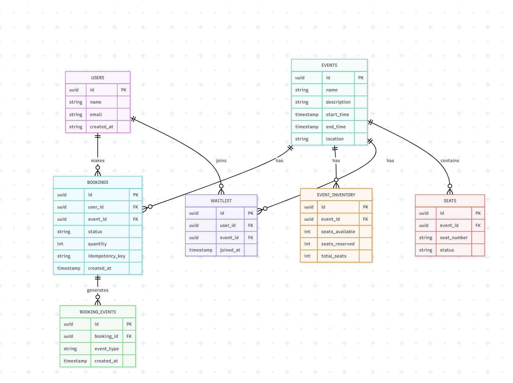

# Atlan Backend Challenge (2025)

## 🌟 Context

Large-scale events often see **thousands of people rushing to book tickets at the same time**.  
Behind the scenes, this requires:

- Handling **concurrency** & preventing overselling.
- Scaling during **traffic spikes**.
- Providing **real-time analytics** to organizers.

This backend — **Evently** — powers such a platform, enabling:

- Users to browse events, book tickets, and track bookings.
- Admins to manage events and view insights.

---

## 🚀 Features

- **User Management**
  - Create, list, and delete users.
- **Event Management**
  - Create, update, list, and delete events.
- **Ticket Booking**
  - Safe, concurrency-aware booking with idempotency.
  - Cancel confirmed bookings and free up inventory.
- **Analytics**
  - Event utilization and booking statistics via materialized views.
- **Database Design**
  - PostgreSQL schema with constraints, indexes, and views.
- **Optional Health Checks**
  - `/` and `/healthz` endpoints for platform readiness.

---

## 🏗️ System Design

### 1. Concurrency & Race Conditions
- **Optimistic locking + transactions** ensure ticket counts are never oversold.
- Every booking updates inventory atomically:
  - `seats_available` decreases
  - `seats_reserved` increases
- Idempotency keys prevent duplicate bookings on retries.

### 2. Database Design
- **Normalized schema** for `users`, `events`, `bookings`, and `inventory`.
- **Materialized views** provide fast analytics queries.
- **Indexes** on event time, bookings, and inventory optimize high-traffic workloads.

### 3. Scalability
- Built with **asyncpg** for high-throughput DB access.
- REST APIs designed to support **thousands of concurrent requests**.
- Indexing + caching opportunities discussed (e.g., Redis for hot stats).

### 4. APIs
- RESTful endpoints for all core features.
- Rich error handling (`404`, `409`, `422`, etc.).
- Interactive **Swagger/OpenAPI docs** at `/docs`.

---
### 🌍 Deployed API (Live)

This project is deployed on Render:

* Base URL: 
```
https://stellar-events-backend.onrender.com
```

* Swagger/OpenAPI docs: 
```
https://stellar-events-backend.onrender.com/docs
```


## Tech Stack

* **Python 3.11**
* **FastAPI**
* **PostgreSQL**
* **Docker & Docker Compose**
* **asyncpg** for async database operations

---

### High-Level Architecture Diagram 


---
## ⚡ Getting Started (Local Development)

### Prerequisites

* Docker & Docker Compose installed
* Python 3.11 (optional if using Docker)
* `git` installed

---

### Clone the repository

```bash
git clone https://github.com/pranavchachra1702/Stellar_Events_Backend.git
cd Stellar_Events_Backend
```

### Option 1: Run with Docker Compose
The repository includes a docker-compose.yml for local development:
```bash
docker-compose up --build

```
This will start:

* PostgreSQL database on port 5432

* FastAPI backend on port 8000

* API docs will be available at:

```
http://localhost:8000/docs
```

### Option 2: Run with Virtual Environment (without Docker)

1. Create a virtual environment:
```bash
python3 -m venv venv
```
2. Activate the environment

Linux/Mac:
```
source venv/bin/activate
```

Windows (PowerShell):
```
.\venv\Scripts\Activate
```

3. Install dependencies using:
```
pip install --upgrade pip
pip install -r requirements.txt
```
4. Environment Variables

Create a `.env` file for local development based on `.env.example`:

```env
DATABASE_URL=postgresql://<DB_USER>:<DB_PASSWORD>@<DB_HOST>:<DB_PORT>/<DB_NAME>
INIT_DB=true
```

---

5. Run the backend
```
uvicorn app.main:app --reload
```

API docs will be available at:

```
http://localhost:8000/docs
```

### Database

The first time you run, the database schema will be initialized automatically if `INIT_DB=true`.

Default credentials in `docker-compose.yml` for local development:

```yaml
POSTGRES_USER: postgres
POSTGRES_PASSWORD: postgres
POSTGRES_DB: evently
```

---
### 📊 ER Diagram



---
### API Endpoints (Overview)

#### Users

* `POST /users/` — create user
* `GET /users/` — list users
* `GET /users/{id}` — get user by ID
* `DELETE /users/{id}` — delete user

#### Events

* `POST /events/` — create event
* `GET /events/` — list events
* `GET /events/{id}` — get event by ID
* `PUT /events/{id}` — update event
* `DELETE /events/{id}` — delete event

#### Bookings

* `POST /bookings/` — book tickets
* `POST /bookings/{id}/cancel` — cancel booking
* `GET /bookings/user/{user_id}` — list user bookings

#### Analytics

* `GET /admin/analytics` — get event booking stats

> Full OpenAPI docs are available at `/docs` when running locally.
